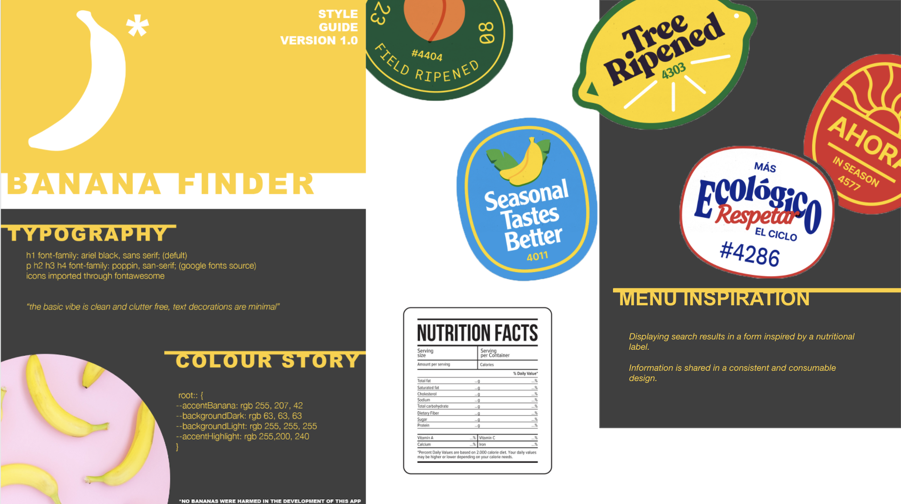
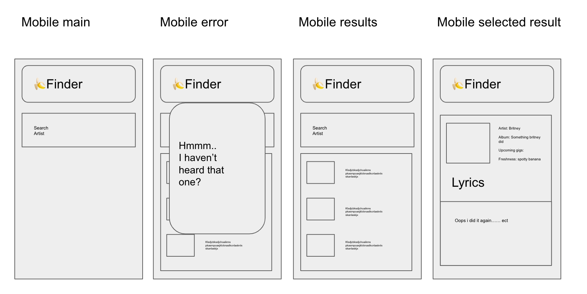

# banana-finder

  

## Table of Contents

  

0. Developed by

1. User Story and Criteria

2. Wire-frame/Chicken Scribble.

3. HTML.

4. CSS stylesheet planing.

5. javaScript

6. File structure.

7. Future improvements.

  

# 0. Developed by:

Project Manager - Sharon

Project Team - Brenton, Lamek, Sasam, Lily

  

  

# 1. User Story

> **AS A** music lover,
> **WHEN I** Cant remember a song, but can remember a lyric I enter it
> **SO THAT** I can search that lyric and find Artist, song and "ripeness then suggests similar songs and playlists.

  

| Task | Status |
|--|--|
| Application is hosted from github | Done |
| Uses a CSS Framework | Done |
| Uses Local Storage | |
| Uses good semantic HTML | |
| Uses at least two API's| Done |
| Is dynamic and responds to user input | Done |
|||

# 2. Wire-frame/Chicken Scribble.

## Basic Mobile Wire-frame

## Style Guide (Starting Point)

  
  

# 3. HTML.

  

1. Use box structure

2. Create easily readable code

3. Include notes

  

# 4. CSS stylesheet planing.

  

1. Multiple style sheets (styleGuide.css and style.css)

2. Use a reset.css

3. Add external font sheet (google fonts ect)

# 5. JavaScript

1. Things to note, we had to convert our first API form XML to JSON before we were able to use any of the d

2. 

3. 

# 6. File structure.

1. Prepared with folder structure to support multiple files of a kind

# 7. Future improvements.